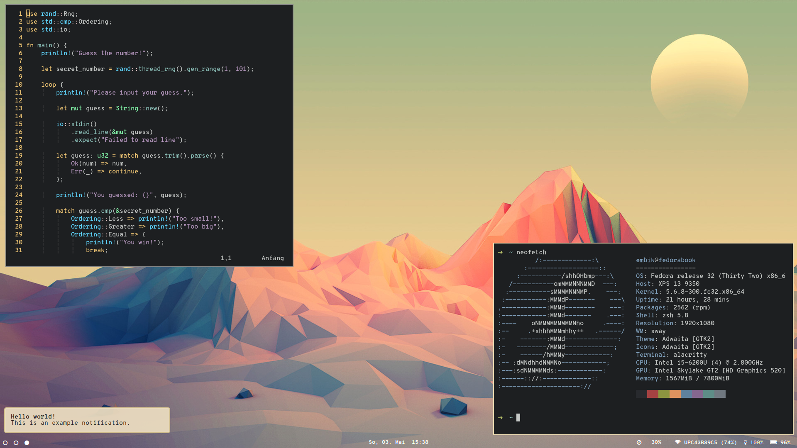

# embik/dotfiles

Personal dotfiles for my sway desktop on Fedora (32). Use [GNU Stow](https://www.gnu.org/software/stow/) to apply dotfiles for some or all applications.

If you're looking for my old dotfiles for Gentoo Linux, see branch [old-dotfiles](https://github.com/embik/dotfiles/tree/old-dotfiles).
